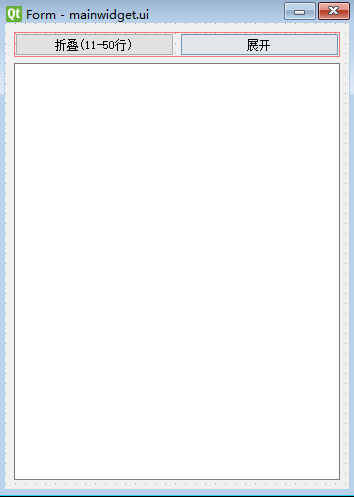
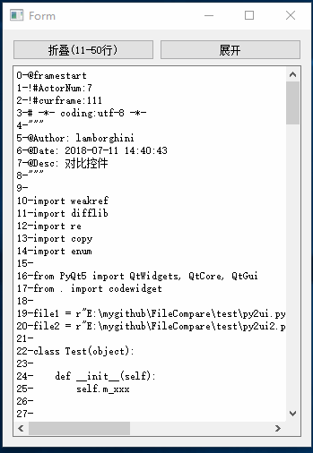
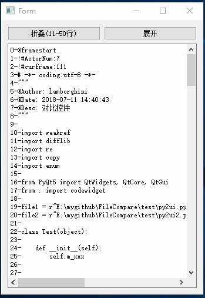

# 一、控件

- QPlainTextEdit ：加载代码，以及使用 QTextBlock针对每行进行处理，比如高亮、隐藏setVisible (False)等，而QTextEdit 默认的 DocumentLayout 不支持隐藏 QTextBlock 。
- QPushButton：添加折叠、展开两个按钮，方便测试。

# 二、界面



- 只是测试改功能，所以用Qtdesigner写了个简易的界面。
- QPlainTextEdit 继承自定义的类CMyText。
- 直接加载代码，然后点击折叠、展开触发操作。

# 三、代码

```python
import sys
import os
from PyQt5 import QtWidgets, QtCore, QtGui

FILE = r"E:\mygithub\FileCompare\test\py2ui.txt"


class CMyText(QtWidgets.QPlainTextEdit):
    m_Start = 10
    m_End = 50

    def __init__(self, parent=None):
        super(CMyText, self).__init__(parent)
        self.InitUI()

    def InitUI(self):
        self.setLineWrapMode(QtWidgets.QPlainTextEdit.NoWrap)
        with open(FILE, "r", encoding="utf8") as fp:
            lstLines = fp.readlines()
            lst = []
            for i, line in enumerate(lstLines):
                lst.append("%s-%s" % (i, line)) # 添加行号，方便直观观察
            self.setPlainText("".join(lst))

    def E_Fold(self):
        document = self.document()
        for x in range(self.m_Start + 1, self.m_End + 1):
            oTextBlock = document.findBlockByNumber(x)
            oTextBlock.setVisible(False)	# 隐藏

    def E_Unfold(self):
        document = self.document()
        for x in range(self.m_Start + 1, self.m_End + 1):
            oTextBlock = document.findBlockByNumber(x)
            oTextBlock.setVisible(True)		# 显示
```

- 这是按照直观想法写出的代码，自然而然想到，隐藏直接将对应的块设置为不可见。


# 四、实际效果花屏问题：



- 可以看到点击之后并不会理解隐藏11-50行。

- 滑动之后才会隐藏，而且滑下去时其实还是经过了11-50行，可以看到再滑上来时，花屏了加载了好几次51行。

- 原因：

  - 点击没反应：点击虽然调用了隐藏，但是界面并没有重绘，所以还需要调用`self.viewport().update()`，展开时也一样。

  - 滚动花屏：滚动时也应该调用`self.viewport().update() `

    ```python
        def scrollContentsBy(self, dx, dy):
            self.viewport().update()
            super(CMyText, self).scrollContentsBy(dx, dy)
    ```

    

# 五、滚动的另一个问题。



- 此时点击立刻隐藏了，但是滑动到10行继续玩下滑动时，滚动条正常向下滑动，代码并没有向下滑，而是过了一段时间才开始滚动。

- 原因：猜想代码其实还是包括隐藏的行，所以滚动时还是会滚过这些隐藏的行。

- 解决：在折叠、展开时调用`document.adjustSize()`即可。

  ```python
      def E_Fold(self):
          document = self.document()
          for x in range(self.m_Start + 1, self.m_End + 1):
              oTextBlock = document.findBlockByNumber(x)
              oTextBlock.setVisible(False)
          self.viewport().update()
          document.adjustSize()
  ```

- 此时完美运行代码折叠、展开。可以继续做自己想做的效果了。